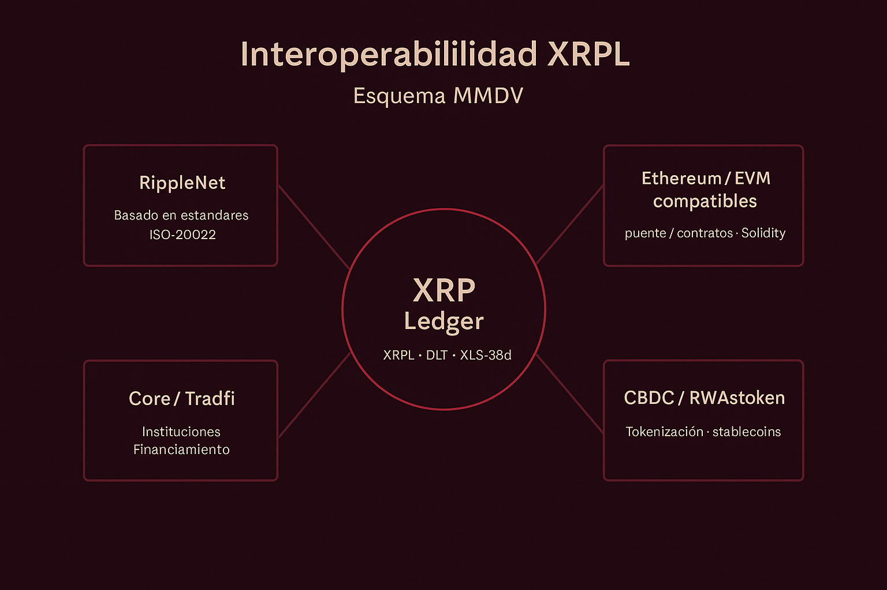

# 🧩 Reto 1 · Interoperabilidad (XRPL)

> “El XRP Ledger no solo conecta redes, sino que redefine cómo entendemos la interoperabilidad financiera del siglo XXI.”

  

---

## 📄 Archivos

- 📑 **Informe:** [informe.md](./informe.md)
- 🔗 **Referencias:** [referencias.md](./referencias.md)
- 🖼️ **Resumen visual (SVG):** [resumen_visual_mmdv_xrpl.svg](./resumen_visual_mmdv_xrpl.svg)
- 📘 **PDF (MMDV):** [Interoperabilidad_XRPL_MMDV.pdf](./docs/Interoperabilidad_XRPL_MMDV.pdf)
